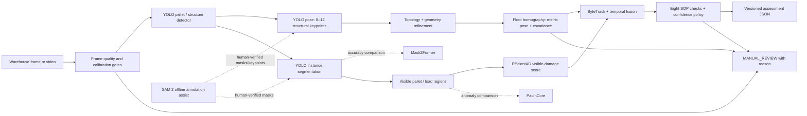

# Delhivery Pallet Audit — real-data implementation

> Status: both user-supplied real Roboflow exports are imported and audited.
> Their original splits contain cross-split perceptual duplicates, so grouped
> leakage-controlled preparation is required before headline training. This
> repository contains no synthetic training result and no unmeasured hardware
> claim.

This project implements one explainable pallet assessment per tracked pallet:
metric floor pose with uncertainty, directed face/orientation, eight SOP checks
with confidence and `PASS` / `FAIL` / `MANUAL_REVIEW`, and overall reasoning.
It is organized in the same order as the assignment rubric.

## Approach and significant decisions

The design is split into measurable perception, geometry, evidence, and policy
stages so a disputed decision can be reconstructed. The main costs are extra
annotation layers, physical calibration/capture, multiple small models, and a
conservative abstention rate. Those costs are preferred to a confident but
untraceable end-to-end verdict.

### 1. Dataset and detection (30%)

The two assignment-listed Roboflow Universe version URLs are pinned in
`configs/data_sources.yaml`. The canonical download format is COCO JSON because
it preserves category metadata, boxes, and polygons without coupling the source
archive to a trainer. `DATASET.md` records the measured counts, sourcing cost,
label rules, biases, licenses, hashes, and the supplier-split leakage finding.

Detection and localization will be reported separately on a source-grouped,
held-out test split that differs from training. Reports will contain per-class
AP/precision/recall and localization IoU/center-error distributions—not only a
single average. The expected accuracy ceiling and training decisions will be
documented beside the measured results.

### 2. Pose estimation (35%)

The final design uses 8–12 human-verified structural pallet keypoints, topology
refinement, and a calibrated floor homography. It reports metric `(x, y)`,
directed yaw `theta`, visible face identity, covariance, and calibration
reprojection error. Translation and rotation errors, sensitivity to height and
camera tilt, short/long-range behavior, and the operating envelope for
`±2 cm / ±3°` will only be filled from a physically measured evaluation set.
Low observability or out-of-envelope inputs must return `MANUAL_REVIEW`.

### 3. SOP verification (25%)

All eight checks from the assignment will be represented in the versioned JSON
contract. Each check has evidence, confidence, thresholds, pose/load weighting,
and a three-way verdict. The implemented subset and any unimplemented checks
will be stated explicitly; missing evidence never silently becomes a pass.

### 4. Deployment (10%)

The intended target is Jetson Orin Nano 15 W at at least 15 FPS. The README will
report actual measured development-hardware latency and memory, then describe
expected Orin changes without borrowing third-party benchmark numbers. Any
TensorRT cost will be reported only after an actual export and measurement.
ByteTrack and temporal confidence fusion reduce flicker while fail-safe gates
handle blur, occlusion, bad calibration, out-of-range pose, and stale tracks.

## Recommended pipeline



Why these roles:

- YOLO provides the deployable real-time baseline for boxes, masks, and
  structural keypoints.
- Mask2Former is an accuracy-oriented segmentation comparison, not the default
  edge model.
- SAM 2 accelerates offline annotation and video propagation; a human approves
  every training label.
- EfficientAD is the preferred lightweight visible-damage baseline; PatchCore
  is the rare-defect comparison.
- Geometry and calibration, rather than an opaque regressor, make metric pose
  traceable and expose uncertainty.

## Reproducibility

```powershell
python -m pip install -e ".[dev]"
Copy-Item .env.example .env
# Put your Roboflow private API key in .env, then:
python tools/download_roboflow.py --config configs/data_sources.yaml
# Or, for ZIPs downloaded through the Roboflow UI:
python tools/import_local_archives.py
python tools/audit_dataset.py
```

The commands below produce manifests and distribution reports. They cannot be
executed against the requested data until the authenticated archives and
model-specific labels exist. Large source archives and model binaries are
excluded from Git; SHA-256 manifests and release-asset instructions keep them
reproducible.

```powershell
# After model-specific labels/data.yaml have passed audit:
python tools/train_yolo.py --task detect --data data/processed/detect/data.yaml --run-name detect-real-v1
python tools/train_yolo.py --task segment --data data/processed/segment/data.yaml --run-name segment-real-v1
python tools/train_yolo.py --task pose --data data/processed/pose/data.yaml --run-name pose-real-v1

# Nominal visible crops versus separately labelled damaged holdout:
python tools/train_anomaly.py --model efficientad --data data/processed/anomaly
python tools/train_anomaly.py --model patchcore --data data/processed/anomaly

# Calibration and distribution reports:
python tools/calibrate_camera.py --images data/calibration/chessboard --columns 9 --rows 6 --square-size-m 0.024
python tools/calibrate_floor_homography.py --points data/calibration/floor_points.csv --calibration-id pillar-camera-v1
python tools/evaluate_detection.py --ground-truth data/holdout/_annotations.coco.json --predictions runs/predictions.json
python tools/evaluate_pose.py --predictions data/holdout/pose_predictions.csv
```

## Results

The raw-data audit measured 2,208 detection images with 63,624 boxes and 1,052
segmentation images with 3,653 polygons. File/task integrity gates pass and no
byte-identical image crosses a split. The supplier splits fail the independence
gate: 110 detection and 5 segmentation perceptual-hash groups cross split
boundaries. Those splits are therefore excluded from headline accuracy claims.

Model distributions, three worst cases, metric calibration envelope, runtime,
and memory remain pending leakage-controlled model training and, for physical
pose/SOP claims, a separately measured assignment-domain capture.

## Failure analysis — three worst cases

Pending real held-out inference. `evaluate_pose.py` ranks the three worst cases
by normalized translation-plus-rotation error; the final report will include
each original image, prediction overlay, error values, observability state, and
root cause. Placeholder or training-set examples are deliberately not shown as
“worst cases.”

## What I couldn't finish and why

- The supplied datasets cover detection and instance segmentation only.
  Detection boxes/polygons cannot be relabelled as pose keypoints, metric pose,
  load dimensions, wrap state, or damage truth.
- Metric pose accuracy requires ruler/tape measurements and camera calibration;
  it cannot be inferred from internet images alone.
- Jetson latency requires the stated Jetson hardware; other machines' numbers
  will not be presented as ours.
- The required five-minute screen recording depends on the real-data pipeline
  and is therefore pending; `docs/demo_script.md` defines the evidence to record.

## AI tool usage

Codex is being used for repository implementation, dataset auditing, tests, and
documentation. The critical error caught during review was that the earlier
prototype trained on procedurally generated labels and described the resulting
checkpoint too broadly. This repository corrects that by accepting only
traceable real data for headline training and evaluation.
