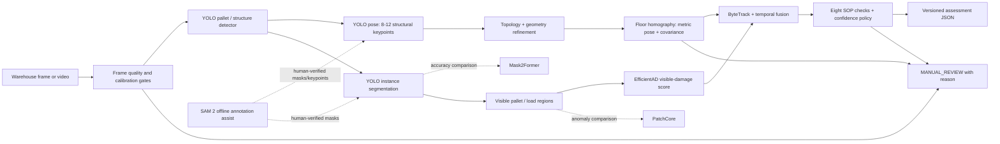
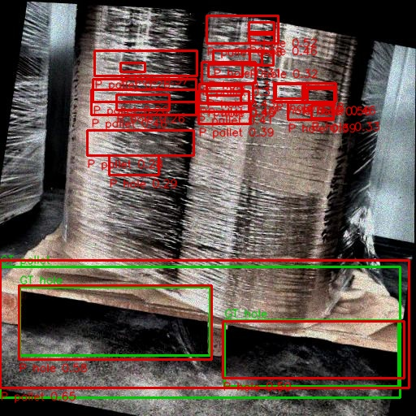
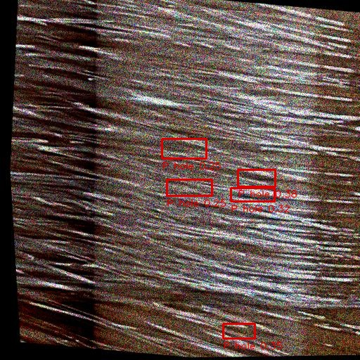
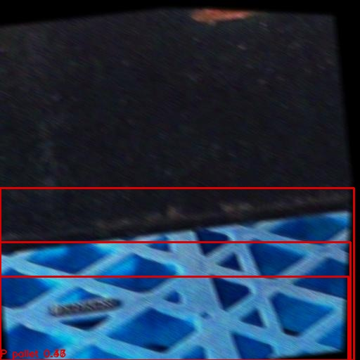

# Delhivery Pallet Audit - real-data implementation

> Status: both user-supplied real Roboflow exports are imported and audited.
> Their original splits contain cross-split perceptual duplicates. The grouped
> real-data detector is trained, independently evaluated, benchmarked, and
> committed with hashed weights. Segmentation data is validated and is the next
> training stage. No result below comes from synthetic data or borrowed hardware.

This project implements one explainable pallet assessment per tracked pallet:
metric floor pose with uncertainty, directed face/orientation, eight SOP checks
with confidence and `PASS` / `FAIL` / `MANUAL_REVIEW`, and overall reasoning.
It is organized in the same order as the assignment rubric.

## Approach and significant decisions

The design is split into measurable perception, geometry, evidence, and policy
stages so a disputed decision can be reconstructed. The main costs are extra
annotation layers, physical calibration/capture, multiple small models, and a
conservative abstention rate. Those costs are preferred to a confident but
untraceable end-to-end verdict.

### 1. Dataset and detection (30%)

The two assignment-listed Roboflow Universe version URLs are pinned in
`configs/data_sources.yaml`. The canonical download format is COCO JSON because
it preserves category metadata, boxes, and polygons without coupling the source
archive to a trainer. `DATASET.md` records the measured counts, sourcing cost,
label rules, biases, licenses, hashes, and the supplier-split leakage finding.

Detection and localization are reported separately on source-grouped holdouts.
The final YOLO11n detector uses COCO-pretrained features, a frozen backbone, a
320 px input, batch 16, and 15 epochs. This made a full CPU run possible in 41.1
minutes, but costs small-hole detail and limits backbone domain adaptation. The
untouched test capture day is declared separately from the harder validation
capture day; neither uses the leaked supplier split.

The observed test mAP50-95 is 0.556. The estimated ceiling for this exact source
taxonomy is roughly 0.65-0.75 with corrected negative labels, 640 px training,
an unfrozen backbone, and more capture days. That is an engineering estimate,
not a measured result, and says nothing about metric pose or a new warehouse.

### 2. Pose estimation (35%)

The final design uses 8-12 human-verified structural pallet keypoints, topology
refinement, and a calibrated floor homography. It reports metric `(x, y)`,
directed yaw `theta`, visible face identity, covariance, and calibration
reprojection error. Translation and rotation errors, sensitivity to height and
camera tilt, short/long-range behavior, and the operating envelope for
`+/-2 cm / +/-3 degrees` will only be filled from a physically measured evaluation set.
Low observability or out-of-envelope inputs must return `MANUAL_REVIEW`.

### 3. SOP verification (25%)

All eight checks from the assignment will be represented in the versioned JSON
contract. Each check has evidence, confidence, thresholds, pose/load weighting,
and a three-way verdict. The implemented subset and any unimplemented checks
will be stated explicitly; missing evidence never silently becomes a pass.

### 4. Deployment (10%)

The intended target is Jetson Orin Nano 15 W at at least 15 FPS. The detector
was actually measured on an Intel Core Ultra 5 125U CPU at 320 px: 36.23 ms
median and 38.60 ms p95 end-to-end per image, or 27.50 FPS over 262 images.
This is one component, not a Jetson or full-pipeline benchmark. Any TensorRT
claim remains pending an actual export and target-device measurement.
ByteTrack and temporal confidence fusion reduce flicker while fail-safe gates
handle blur, occlusion, bad calibration, out-of-range pose, and stale tracks.

## Recommended pipeline



Why these roles:

- YOLO provides the deployable real-time baseline for boxes, masks, and
  structural keypoints.
- Mask2Former is an accuracy-oriented segmentation comparison, not the default
  edge model.
- SAM 2 accelerates offline annotation and video propagation; a human approves
  every training label.
- EfficientAD is the preferred lightweight visible-damage baseline; PatchCore
  is the rare-defect comparison.
- Geometry and calibration, rather than an opaque regressor, make metric pose
  traceable and expose uncertainty.

## Reproducibility

```powershell
python -m pip install -e ".[dev]"
Copy-Item .env.example .env
# Put your Roboflow private API key in .env, then:
python tools/download_roboflow.py --config configs/data_sources.yaml
# Or, for ZIPs downloaded through the Roboflow UI:
python tools/import_local_archives.py
python tools/audit_dataset.py
python tools/prepare_yolo.py --source data/raw/pallet_detect_v1 --output data/processed/detect --task detect --report reports/detection_preparation.json
python tools/prepare_yolo.py --source data/raw/plh_c_1_v1 --output data/processed/segment --task segment --report reports/segmentation_preparation.json
python tools/validate_yolo_dataset.py --input data/processed/detect --task detect --report reports/detection_validation.json
python tools/validate_yolo_dataset.py --input data/processed/segment --task segment --report reports/segmentation_validation.json
```

The commands below reproduce training and evaluation after the ignored raw data
is imported. Source archives remain excluded from Git. Compact selected weights
are committed under `weights/releases` and verified by SHA-256 reports.

```powershell
# Measured detector run:
python tools/train_yolo.py --task detect --data data/processed/detect/data.yaml --epochs 15 --image-size 320 --batch 16 --device cpu --workers 0 --cache false --freeze 10 --patience 5 --run-name detect-real-v1
python tools/evaluate_yolo.py --task detect --model runs/yolo/detect-real-v1/weights/best.pt --data data/processed/detect/data.yaml --split test --image-size 320 --output reports/detection_test_evaluation.json --overlays reports/failure_cases/detection
python tools/benchmark_yolo.py --model runs/yolo/detect-real-v1/weights/best.pt --images data/processed/detect/images/test --device cpu --image-size 320 --warmup 10 --repeat 1 --output reports/runtime_detection_cpu.json

# Remaining label-supported training:
python tools/train_yolo.py --task segment --data data/processed/segment/data.yaml --run-name segment-real-v1
python tools/train_yolo.py --task pose --data data/processed/pose/data.yaml --run-name pose-real-v1

# Nominal visible crops versus separately labelled damaged holdout:
python tools/train_anomaly.py --model efficientad --data data/processed/anomaly
python tools/train_anomaly.py --model patchcore --data data/processed/anomaly

# Calibration and distribution reports:
python tools/calibrate_camera.py --images data/calibration/chessboard --columns 9 --rows 6 --square-size-m 0.024
python tools/calibrate_floor_homography.py --points data/calibration/floor_points.csv --calibration-id pillar-camera-v1
python tools/evaluate_detection.py --ground-truth data/holdout/_annotations.coco.json --predictions runs/predictions.json
python tools/evaluate_pose.py --predictions data/holdout/pose_predictions.csv
```

## Results

The raw-data audit measured 2,208 detection images with 63,624 boxes and 1,052
segmentation images with 3,653 polygons. File/task integrity gates pass. The
supplier splits fail independence because 110 detection and 5 segmentation
perceptual-hash groups cross boundaries. The replacement split has zero
cross-split groups and holds out whole capture days for detection: 1,488 train,
458 validation, and 262 test images. Segmentation has 841/106/105 images.

The committed detector checkpoint is
[`weights/releases/detect-real-v1.pt`](weights/releases/detect-real-v1.pt)
(5,427,738 bytes; SHA-256
`36273b60fb817a0d869188714c90ca8156a3370bb6da1d3536d71f7359cb7662`).

| Split | Images / instances | Precision | Recall | mAP50 | mAP50-95 |
|---|---:|---:|---:|---:|---:|
| Validation (2025-08-13 group plus non-date groups) | 458 / 1,960 | 0.610 | 0.837 | 0.628 | 0.421 |
| Test (2025-08-06 group plus non-date groups) | 262 / 573 | 0.905 | 0.826 | 0.876 | 0.556 |

Test per-class results are `hole`: P 0.945, R 0.768, AP50 0.882,
mAP50-95 0.508; and `pallet`: P 0.865, R 0.885, AP50 0.871,
mAP50-95 0.604. The easier test-day distribution explains why test exceeds
validation; it is not evidence that the new warehouse domain is solved.

Localization is measured separately for 501 test predictions matched at IoU
0.50 and confidence 0.25. Matched IoU mean/p05/p50/p95 is
0.818/0.628/0.834/0.943. Center error mean/p50/p95/max is
5.63/4.38/13.61/60.87 px; normalized by ground-truth box diagonal it is
0.0217/0.0166/0.0515/0.1413. Raw distributions are committed in
`reports/detection_test_evaluation.json`.

On Windows 11, PyTorch 2.8 CPU, eight inference threads, and an Intel Core Ultra
5 125U, 262 single-image runs measured 36.36 ms mean, 36.23 ms median,
38.60 ms p95, and 51.07 ms max end-to-end (27.50 FPS from total wall time).
Decode and the rest of the perception/SOP pipeline are excluded.

## Failure analysis - three worst cases

At fixed confidence 0.25, the worst real test image contains three labelled
instances but 25 unmatched predictions. Stretch-wrap highlights, carton faces,
labels, and load gaps resemble the dominant hole class. The fix is hard-negative
mining, class-specific calibration, and accepting holes only within supported
pallet geometry.



The second is a negative close-up of reflective stretch wrap. Horizontal glare
triggers five hole predictions, showing missing wrap-only negative coverage.



The third is numerically ranked as a false-positive case, but visual review
shows a blue plastic pallet with no ground-truth instance. This is a dataset
annotation/scope omission, so the reported false-positive count overstates model
error. The holdout negatives require adjudication before acceptance testing.



## What I couldn't finish and why

- The supplied datasets cover detection and instance segmentation only.
  Detection boxes/polygons cannot be relabelled as pose keypoints, metric pose,
  load dimensions, wrap state, or damage truth.
- Metric pose accuracy requires ruler/tape measurements and camera calibration;
  it cannot be inferred from internet images alone.
- EfficientAD and PatchCore cannot be trained honestly from these archives:
  neither contains reviewed `good`/`bad` damage labels. Synthetic defects are
  deliberately not substituted.
- Jetson latency requires the stated Jetson hardware; other machines' numbers
  will not be presented as ours.
- The required five-minute screen recording depends on the real-data pipeline
  and is therefore pending; `docs/demo_script.md` defines the evidence to record.

## AI tool usage

Codex is being used for repository implementation, dataset auditing, tests, and
documentation. The critical error caught during review was that the earlier
prototype trained on procedurally generated labels and described the resulting
checkpoint too broadly. This repository corrects that by accepting only
traceable real data for headline training and evaluation.
