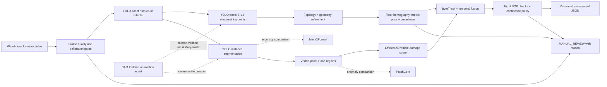

# Delhivery Pallet Audit — real-data implementation

> Status: repository initialized; Roboflow exports and all measured results are
> blocked until `ROBOFLOW_API_KEY` is supplied. This repository deliberately
> contains no synthetic training result and no unmeasured hardware claim.

This project implements one explainable pallet assessment per tracked pallet:
metric floor pose with uncertainty, directed face/orientation, eight SOP checks
with confidence and `PASS` / `FAIL` / `MANUAL_REVIEW`, and overall reasoning.
It is organized in the same order as the assignment rubric.

## 1. Dataset and detection (30%)

The two user-selected Roboflow Universe version URLs are pinned in
`configs/data_sources.yaml`. The canonical download format is COCO JSON because
it preserves category metadata and bounding boxes without coupling the source
archive to a trainer. A deterministic preparation step will convert audited
records to YOLO format. Dataset counts, splits, label rules, cost assumptions,
biases, duplicates, and provenance will be recorded in `DATASET.md` after the
archives are downloaded.

Detection and localization will be reported separately on a source-grouped,
held-out test split that differs from training. Reports will contain per-class
AP/precision/recall and localization IoU/center-error distributions—not only a
single average. The expected accuracy ceiling and training decisions will be
documented beside the measured results.

## 2. Pose estimation (35%)

The final design uses 8–12 human-verified structural pallet keypoints, topology
refinement, and a calibrated floor homography. It reports metric `(x, y)`,
directed yaw `theta`, visible face identity, covariance, and calibration
reprojection error. Translation and rotation errors, sensitivity to height and
camera tilt, short/long-range behavior, and the operating envelope for
`±2 cm / ±3°` will only be filled from a physically measured evaluation set.
Low observability or out-of-envelope inputs must return `MANUAL_REVIEW`.

## 3. SOP verification (25%)

All eight checks from the assignment will be represented in the versioned JSON
contract. Each check has evidence, confidence, thresholds, pose/load weighting,
and a three-way verdict. The implemented subset and any unimplemented checks
will be stated explicitly; missing evidence never silently becomes a pass.

## 4. Deployment (10%)

The intended target is Jetson Orin Nano 15 W at at least 15 FPS. The README will
report actual measured development-hardware latency and memory, then describe
expected Orin changes without borrowing third-party benchmark numbers. Any
TensorRT cost will be reported only after an actual export and measurement.
ByteTrack and temporal confidence fusion reduce flicker while fail-safe gates
handle blur, occlusion, bad calibration, out-of-range pose, and stale tracks.

## Recommended pipeline



Why these roles:

- YOLO provides the deployable real-time baseline for boxes, masks, and
  structural keypoints.
- Mask2Former is an accuracy-oriented segmentation comparison, not the default
  edge model.
- SAM 2 accelerates offline annotation and video propagation; a human approves
  every training label.
- EfficientAD is the preferred lightweight visible-damage baseline; PatchCore
  is the rare-defect comparison.
- Geometry and calibration, rather than an opaque regressor, make metric pose
  traceable and expose uncertainty.

## Reproducibility

```powershell
python -m pip install -e ".[dev]"
Copy-Item .env.example .env
# Put your Roboflow private API key in .env, then:
python tools/download_roboflow.py --config configs/data_sources.yaml
python tools/audit_dataset.py
```

The commands below produce manifests and distribution reports. They cannot be
executed against the requested data until the authenticated archives and
model-specific labels exist. Large source archives and model binaries are
excluded from Git; SHA-256 manifests and release-asset instructions keep them
reproducible.

```powershell
# After model-specific labels/data.yaml have passed audit:
python tools/train_yolo.py --task detect --data data/processed/detect/data.yaml --run-name detect-real-v1
python tools/train_yolo.py --task segment --data data/processed/segment/data.yaml --run-name segment-real-v1
python tools/train_yolo.py --task pose --data data/processed/pose/data.yaml --run-name pose-real-v1

# Nominal visible crops versus separately labelled damaged holdout:
python tools/train_anomaly.py --model efficientad --data data/processed/anomaly
python tools/train_anomaly.py --model patchcore --data data/processed/anomaly

# Calibration and distribution reports:
python tools/calibrate_camera.py --images data/calibration/chessboard --columns 9 --rows 6 --square-size-m 0.024
python tools/calibrate_floor_homography.py --points data/calibration/floor_points.csv --calibration-id pillar-camera-v1
python tools/evaluate_detection.py --ground-truth data/holdout/_annotations.coco.json --predictions runs/predictions.json
python tools/evaluate_pose.py --predictions data/holdout/pose_predictions.csv
```

## Results

No result is claimed before it is measured on the real, leakage-controlled
held-out set. The results tables, distributions, three worst cases with images
and root causes, calibration envelope, runtime, and memory remain pending the
authenticated dataset download and physical calibration/evaluation capture.

## Could not finish yet and why

- Roboflow's official export API returned `401` for both public version URLs
  because exports require an API key. No `ROBOFLOW_API_KEY` is present locally.
- The advertised source tasks must be verified from the downloaded metadata.
  Detection boxes cannot be relabeled as pose keypoints, masks, or damage truth.
- Metric pose accuracy requires ruler/tape measurements and camera calibration;
  it cannot be inferred from internet images alone.
- Jetson latency requires the stated Jetson hardware; other machines' numbers
  will not be presented as ours.

## AI tools and error caught

Codex is being used for repository implementation, dataset auditing, tests, and
documentation. The critical error caught during review was that the earlier
prototype trained on procedurally generated labels and described the resulting
checkpoint too broadly. This repository corrects that by accepting only
traceable real data for headline training and evaluation.
